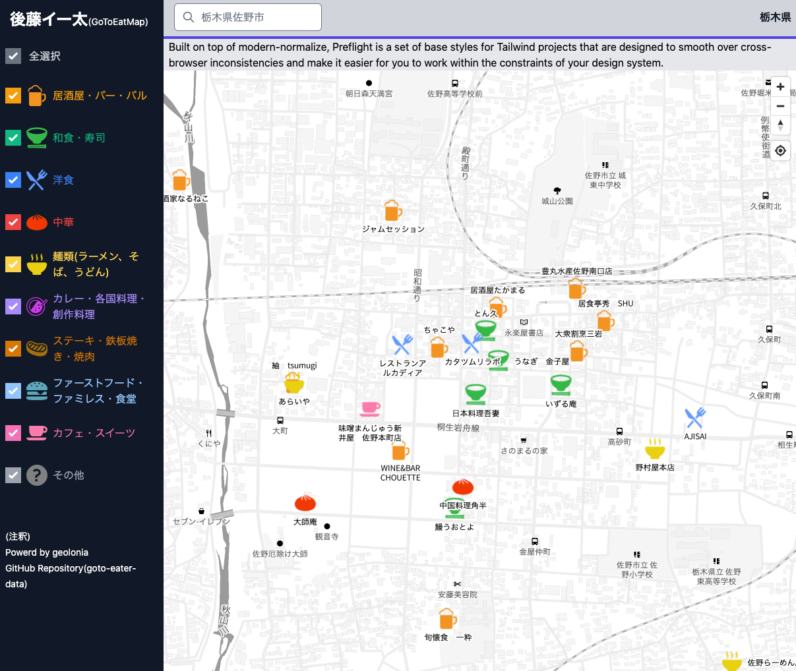

goto-eater
===

(WIP) GoToEat食事券が使える店舗を表示するやつ。



# 特徴

* (ほぼ)全国対応
* ジャンル別の表示
* WebGLによるスムーズな地図表示(Mapbox GL JS互換)

## 構成要素

* [Vue.js](https://jp.vuejs.org/index.html)
  * (2.x)
* [Tailwind CSS](https://tailwindcss.com/)
  * PostCSS7
* [geolonia](https://geolonia.com/)
  * (public beta)

# Quick Start

## 事前準備

* install npm
* [geolonia API_KEY](https://app.geolonia.com/?lang=ja#/signup)の払い出し
  * http://localhost:8081/ など、開発用のURLを指定しておく

```
$ git clone git@github.com:terukizm/goto-eater.git
$ cd goto-eater/

$ cp .env.local.example .env.local
$ vi .env.local
---
VUE_APP_GEOLONIA_API_KEY='xxxxxxxxxxxxxxxxxxxxxxxxxxx'
---

$ npm install
$ npm run serve
-> http://localhost:8081/
```

# 開発メモ

* js
  * コーディングスタイルはVueCLIで生成される組み込みeslint+prettier(デフォルト設定)任せ
  * TS未導入
  * Vuexなし、Vue Routerのみ有効化
* CSS
  * CSSプリプロセッサは使わず、tailwindcssだけでゴリゴリ書いてる

## TODO(Doing):

- [ ] [community-geocoder](https://github.com/geolonia/community-geocoder)の組み込み
  - [ ] 住所を入力し、そこを中心として地図表示
- [ ] 左袖メニューとの連携
  - [ ] チェックボックスの状態でレイヤーの出し分け
- [ ] マーカークリック時のPopup処理

## Project setup
```
npm install
```

### Compiles and hot-reloads for development
```
npm run serve
```

### Compiles and minifies for production
```
npm run build
```

### Lints and fixes files
```
npm run lint
```

### Customize configuration
See [Configuration Reference](https://cli.vuejs.org/config/).
